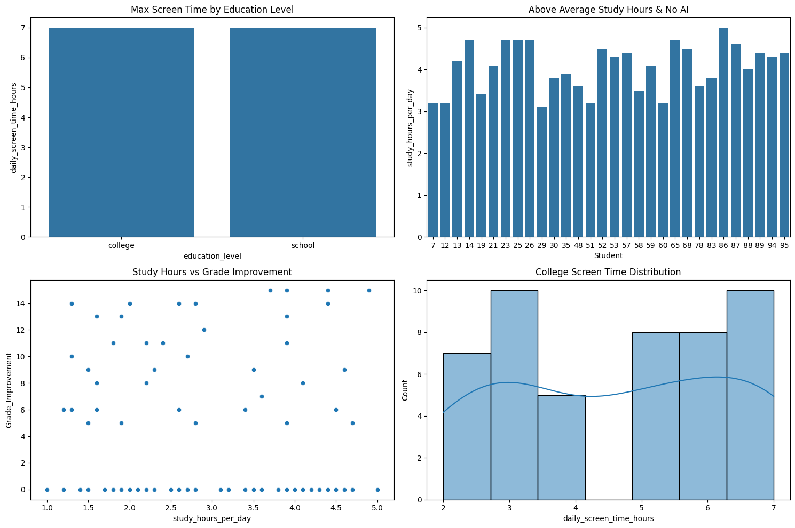
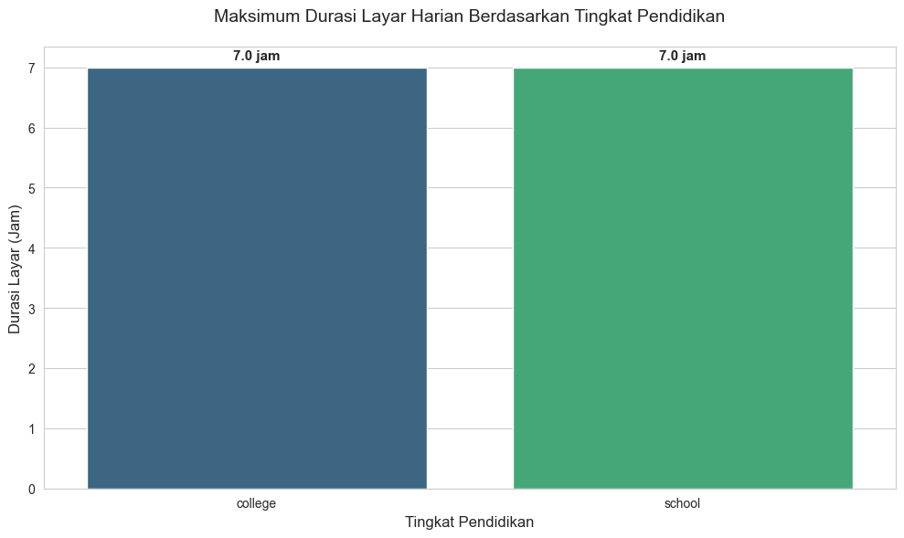
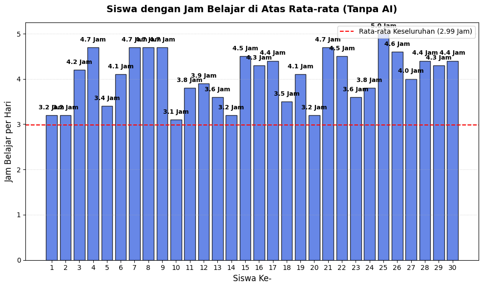
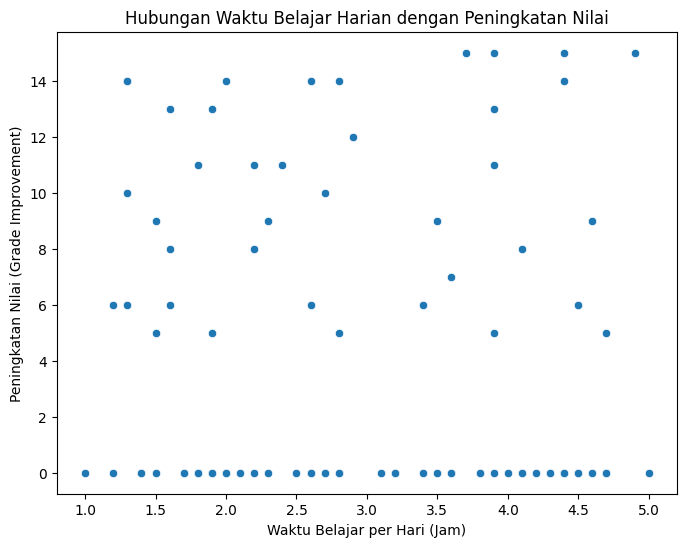
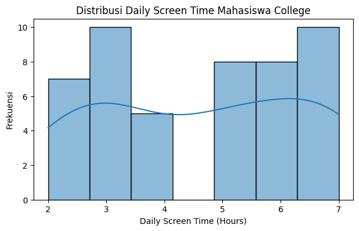

<div align="center">

# 📊 Student AI Usage Visualization

### Analisis dan visualisasi data penggunaan AI pada pelajar

<a href="https://www.python.org/"></a>
<a href="https://jupyter.org/"></a>
<a href="https://pandas.pydata.org/"></a> 
<a href="https://matplotlib.org/"></a>
<a href="https://seaborn.pydata.org/"></a>

</div>

---

## 🖼️ Preview

<p align="center">
  
</p>

---

## 📌 About The Project

**Student AI Usage Visualization** adalah project eksplorasi data sederhana yang bertujuan untuk melihat pola penggunaan AI dalam aktivitas belajar. Dataset yang digunakan adalah `Kelas F_Student AI Usage.csv`, kemudian divisualisasikan menggunakan beberapa notebook Jupyter.

Project ini membahas beberapa hal utama, seperti:

- hubungan antara penggunaan AI dan peningkatan nilai;
- perbandingan durasi screen time berdasarkan tingkat pendidikan;
- siswa/mahasiswa yang belajar di atas rata-rata tetapi tidak menggunakan AI;
- distribusi screen time untuk responden tingkat college;
- rangkuman seluruh grafik dalam satu visualisasi gabungan.

---

## ✨ Features

- 📁 Membaca dataset CSV menggunakan `pandas`
- 📊 Membuat bar chart, scatter plot, dan histogram
- 🧠 Menghitung peningkatan nilai sebelum dan sesudah penggunaan AI
- 🎓 Membandingkan data berdasarkan tingkat pendidikan
- 🖥️ Menganalisis durasi screen time harian
- 🧩 Menggabungkan semua grafik ke dalam layout 2 x 2

---

## 🛠️ Built With

Project ini dibuat menggunakan:

| Tools | Fungsi |
| --- | --- |
| **Python** | Bahasa pemrograman utama |
| **Jupyter Notebook** | Menjalankan analisis dan visualisasi |
| **pandas** | Membaca dan mengolah dataset |
| **matplotlib** | Membuat visualisasi dasar |
| **seaborn** | Membuat visualisasi statistik yang lebih rapi |

---

## 📂 Project Structure

```bash
.
├── Infografis Post Test LinkedIn/
│   ├── 1.jpg
│   ├── 2.jpg
│   ├── 3.jpg
│   ├── 4.jpg
│   └── 5.jpg
│   └── 6.jpg
├── assets/
│   ├── grafik-1-kategori-a.png
│   ├── grafik-2-kategori-b.png
│   ├── grafik-3-kategori-c.png
│   ├── grafik-4-kategori-d.png
│   └── grafik-5-gabungan.png
│   └── preview.png
├── Grafik 1 (Kategori A).ipynb
├── Grafik 2 (Kategori B).ipynb
├── Grafik 3 (Kategori C).ipynb
├── Grafik 4 (Kategori D).ipynb
├── Grafik 5 (Gabungan).ipynb
├── Infografis Post Test Instagram Story.png
├── Kelas F_Student AI Usage.csv
└── README.md
```

---

## 📊 Dataset Overview

Dataset terdiri dari **100 responden** dengan **9 kolom utama**.

| Kolom | Deskripsi |
| --- | --- |
| `age` | Usia responden |
| `education_level` | Tingkat pendidikan, yaitu `school` atau `college` |
| `study_hours_per_day` | Rata-rata jam belajar per hari |
| `uses_ai` | Status penggunaan AI, yaitu `Yes` atau `No` |
| `ai_tools_used` | Tools AI yang digunakan, seperti ChatGPT, Gemini, Copilot, atau kosong |
| `purpose_of_ai` | Tujuan penggunaan AI, seperti Research, Homework, Coding, atau kosong |
| `grades_before_ai` | Nilai sebelum penggunaan AI |
| `grades_after_ai` | Nilai setelah penggunaan AI |
| `daily_screen_time_hours` | Durasi screen time harian dalam jam |

---

## 📈 Visualization List

| Notebook | Visualisasi | Deskripsi |
| --- | --- | --- |
| `Grafik 1 (Kategori A).ipynb` | Bar Chart | Maksimum screen time harian berdasarkan tingkat pendidikan |
| `Grafik 2 (Kategori B).ipynb` | Bar Chart | Responden dengan jam belajar di atas rata-rata dan tidak menggunakan AI |
| `Grafik 3 (Kategori C).ipynb` | Scatter Plot | Hubungan jam belajar harian dengan peningkatan nilai |
| `Grafik 4 (Kategori D).ipynb` | Histogram | Distribusi screen time harian pada responden college |
| `Grafik 5 (Gabungan).ipynb` | Combined Plot | Gabungan seluruh visualisasi dalam layout 2 x 2 |

---

## 🔍 Chart Preview

<details>
<summary><b>Grafik 1 — Maksimum Screen Time berdasarkan Education Level</b></summary>

<br>

<p align="center">
  
</p>

</details>

<details>
<summary><b>Grafik 2 — Jam Belajar di atas Rata-rata dan Tidak Menggunakan AI</b></summary>

<br>

<p align="center">
  
</p>

</details>

<details>
<summary><b>Grafik 3 — Study Hours vs Grade Improvement</b></summary>

<br>

<p align="center">
  
</p>

</details>

<details>
<summary><b>Grafik 4 — Distribusi Screen Time untuk College</b></summary>

<br>

<p align="center">
  
</p>

</details>

---

## 🧠 Key Insights

Beberapa insight dari dataset:

- Total data yang dianalisis adalah **100 responden**.
- Terdapat **52 responden school** dan **48 responden college**.
- Sebanyak **40 responden menggunakan AI**, sedangkan **60 responden tidak menggunakan AI**.
- Rata-rata jam belajar per hari adalah sekitar **2,99 jam**.
- Maksimum screen time harian untuk `school` dan `college` sama-sama mencapai **7 jam**.
- Rata-rata peningkatan nilai seluruh responden adalah sekitar **3,93 poin**.
- Responden yang menggunakan AI memiliki rata-rata peningkatan nilai sekitar **9,83 poin** pada dataset ini.

---

## 🚀 Getting Started

Ikuti langkah berikut untuk menjalankan project secara lokal.

### 1. Clone Repository

```bash
git clone https://github.com/username/student-ai-usage-visualization.git
cd student-ai-usage-visualization
```

> Ganti `username` dan `student-ai-usage-visualization` sesuai nama akun dan repository GitHub kamu.

### 2. Buat Virtual Environment

```bash
python -m venv .venv
```

Aktifkan virtual environment:

```bash
# Windows
.venv\Scripts\activate

# macOS/Linux
source .venv/bin/activate
```

### 3. Install Dependencies

```bash
pip install pandas matplotlib seaborn notebook
```

Atau buat file `requirements.txt`:

```txt
pandas
matplotlib
seaborn
notebook
```

Lalu jalankan:

```bash
pip install -r requirements.txt
```

### 4. Jalankan Notebook

```bash
jupyter notebook
```

Setelah Jupyter terbuka, pilih notebook yang ingin dijalankan.

---

## ▶️ Usage

Untuk melihat seluruh hasil visualisasi dalam satu tampilan, jalankan notebook:

```bash
Grafik 5 (Gabungan).ipynb
```

Pastikan file dataset berikut berada di folder yang sama dengan notebook:

```bash
Kelas F_Student AI Usage.csv
```

Contoh kode utama:

```python
import pandas as pd
import matplotlib.pyplot as plt
import seaborn as sns

# Load dataset
df = pd.read_csv("Kelas F_Student AI Usage.csv")

# Menghitung peningkatan nilai
df["Grade_Improvement"] = df["grades_after_ai"] - df["grades_before_ai"]
```

---

## 💡 Future Improvement

Beberapa pengembangan yang bisa ditambahkan:

- membuat dashboard interaktif menggunakan Streamlit;
- menambahkan analisis korelasi antarvariabel;
- menyimpan grafik otomatis ke folder `assets`;
- menambahkan file `requirements.txt`;
- membuat visualisasi tambahan berdasarkan tools AI yang digunakan;
- menambahkan kesimpulan akhir berbasis analisis statistik.

---

## 👤 Author

**Sharon Stefania**
NIM : 21060125120039
Universitas Diponegoro

Rincian tugas setiap anggota kelompok
1. Wikandaru Baasithulkhoir	(21060125120020) : Pengodean Kategori A Grafik 1
2. Lirza Yuli Panjaitan (21060125120022) : Pengodean Kategori B Grafik 2 dan Plot Grid
3. Sharon Stefania (21060125120039) : Desain Infografis
4. Johann Antonio (21060125120050) : Pengodean Kategori C Grafik 3
5. Robi Irhamni (21060125120052) : Pengodean Kategori D Grafik 4
---

## 📄 License

Project ini dapat digunakan untuk keperluan pembelajaran, eksplorasi data, dan pengembangan portofolio.

<div align="center">

⭐ Jangan lupa beri star pada repository ini jika project ini bermanfaat.

</div>
